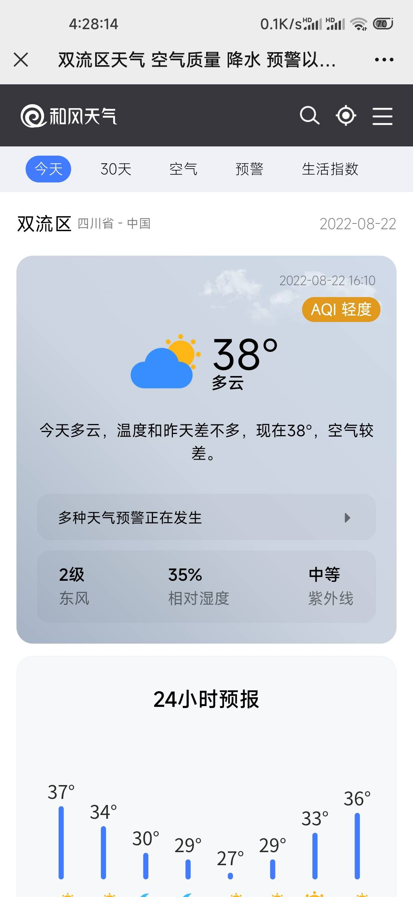

<h1 align="center">DailyInfo</h1>
<h6 align="center">基于云函数的企业微信每日推送</h6>

## Introduction

- Bing必应 每日壁纸
- 金山词霸 每日一句
- 和风天气 天气预报
- ONE·一个 一图一句
- 多图文并自带图文展示页

## Preparation

|     参数     |         含义          | 备注 |
| :----------: | :-------------------: | :--: |
|    corpid    |    企业微信企业ID     | 必填 |
|  corpsecret  |  企业微信应用Secret   | 必填 |
|   agentid    |  企业微信应用AgentId  | 必填 |
| qweather_key |    和风天气应用Key    | 必填 |
|     city     | 天气预报地址 市/区/县 | 必填 |

## Preview

<div align=center>      </div>

## Deployment

以腾讯云函数为例：

### 1.创建函数：

新建 / 从头开始 / 事件函数 / 环境 Python3.6 / 内存 64MB / 执行超时时间 900秒 / 环境变量填入 **TZ**（Key） **Asia/Shanghai**（Value）/ 自行设置触发器，其余内容保持默认 / 完成

### 2. 克隆代码：

函数代码 / 提交方法-在线编辑 / 删除整个src文件夹 / 点击 终端-新终端 / 复制粘贴执行以下命令

```shell
git clone https://gitee.com/thund1r/daily-info.git
```

```shell
mv daily-info src
```

### 3.完善配置：

完善 **src/index.py** 中的参数**corpid**、**corpsecret**、**agentid**、**qweather_key**、**city** 配置

点击**部署**，部署成功后点击**测试**，查看日志输出以及微信消息

配置**触发器**即可实现每天定时消息推送