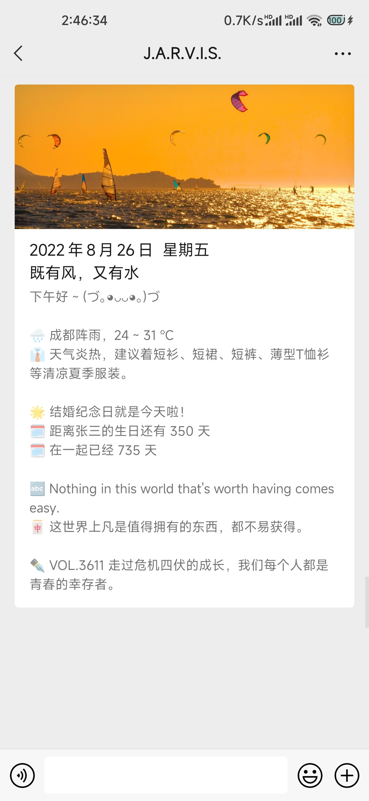
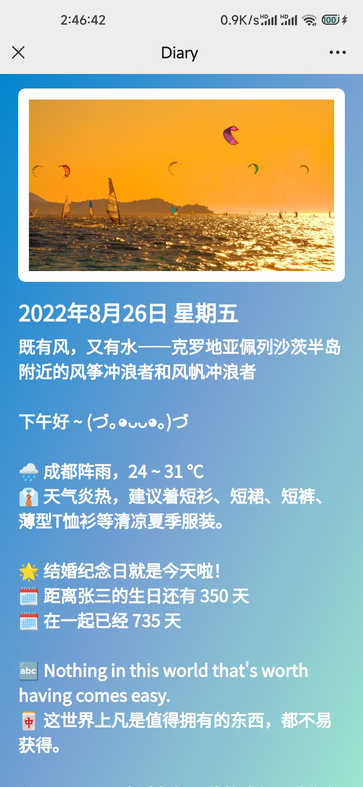
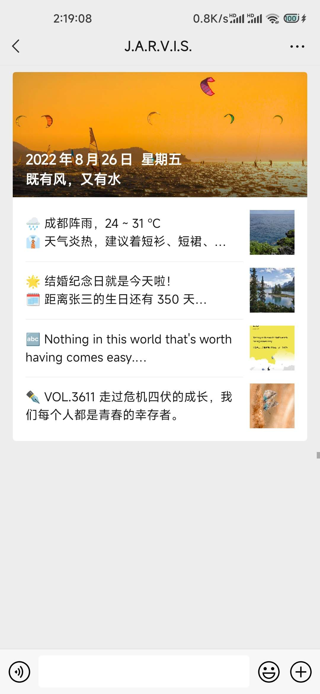

<h1 align="center">DailyInfo</h1>
<h6 align="center">基于云函数的企业微信每日图文推送</h6>

## Introduction

- Bing必应 每日壁纸
- 金山词霸 每日一句
- ONE·一个 一图一句
- 和风天气 多地区天气预报
- 农历 / 公历多日期纪念日 / 单日提醒
- 可选的单图文 / 多图文推送模式
- 自带图文展示页

## Preparation

|  环境变量  |                             含义                             |  备注  |
| :--------: | :----------------------------------------------------------: | :----: |
|   corpid   |                        企业微信企业ID                        |  必填  |
| corpsecret |                      企业微信应用Secret                      |  必填  |
|  agentid   |                     企业微信应用AgentId                      |  必填  |
|  qweather  |                       和风天气应用Key                        | 非必填 |
|    city    |      天气预报地址<br />多地区以&&间隔，例如：成都&&昆明      | 非必填 |
| beginname  | 单日项目名称，只有某一年有的日子<br />多日期以&&分隔，例如跟XX在一起&&某某某出生 | 非必填 |
|  beginday  | 单日日期，公历格式20XX-XX-XX，农历年份前加n<br />多日期以&&分隔，如n2020-08-11&&2021-08-26，注意与名称对应 | 非必填 |
| targetname | 纪念日名称，每年都有的日子<br />多日期以&&分隔，如：某某某的生日&&结婚纪念日 | 非必填 |
| targetday  | 纪念日日期，公历格式20XX-XX-XX，农历年份前加n<br />多日期以&&分隔，如n2020-08-11&&2021-08-26，注意与名称对应 | 非必填 |
|  msgtype   |        图文类型，1为单图文，2为多图文<br />默认单图文        | 非必填 |

## Preview

- 单图文

<div align=center>    </div>

- 多图文

<div align=center>    </div>

## Deployment

以腾讯云函数为例：

### 1. 创建函数：

新建 / 从头开始 / 事件函数 / 环境 Python3.7 / 内存 64MB / 执行超时时间 900秒 / 填入环境变量 / 自行设置触发器，其余内容默认 / 完成

### 2. 配置代码：

函数代码 / 提交方法 - 在线编辑 / 点击 终端-新终端 / 复制粘贴执行以下命令

```shell
rm -rf src
git clone https://gitee.com/thund1r/daily-info.git
mv daily-info src
cd src
pip3 install zhdate requests -t .

```

所有命令执行完毕后，点击**部署**，部署成功后点击**测试**，查看日志输出以及微信消息

配置**触发器**即可实现每天定时消息推送

### 3. 更新代码：

新终端执行以下命令

```shell
cd src
git pull

```

更新完后再次部署和测试即可

## Notice

> **2022-08-26 更新**：   
> 加回多图文方案，通过环境变量msgtype选择   
> 删除环境变量TZ，改为代码内实现确定时区   
> 重新上线 ONE·一个 图文功能，单图文模式下只显示文字内容，多图文模式下显示图文   
> 日期提醒全部支持农历/公历，统一自动排序保证提醒有效性    
>
> **2022-08-25 更新**：   
> 放弃原有多图文方案，采用单图文展示所有信息，更加直观方便   
> 新增随机颜文字、自动更换天气emoji、正向日期计算   
> 暂时下线 ONE·一个 图文功能   

- 所有环境变量均可通过直接修改 **config.py** 完成配置，系统环境变量优先级高于 **config.py** 。
- 受企业微信API限制，超出字数限制部分文字将自动截断不展示。图文展示页面不受此限制，但仍受图片链接长度和文字长度的制约，**请合理安排多地区天气、多日期提醒等内容**。
- **日期提醒** 会自动排序，越接近的时间越显示在上方，以保证提醒的有效性。
- **和风天气预报** 会根据天气文本信息自动更换对应的天气emoji图标。
- 腾讯云日志服务CLS将于2022年9月5日开始执行按量计费。请在配置并测试好云函数之后及时前往 **函数管理 - 函数配置** 中关闭日志投递，并在 [日志服务 CLS 控制台](https://console.cloud.tencent.com/cls) - 日志主题 中删除相应日志主题。
- **图文展示页** 来自我的项目 **Diary** —— 基于 Python Fastapi 部署于 Vercel 的简易图文展示，通过URL传递参数实现，不存储任何数据，开源地址  [Github](https://github.com/Thund1R/diary)     [Gitee](https://gitee.com/thund1r/diary)

